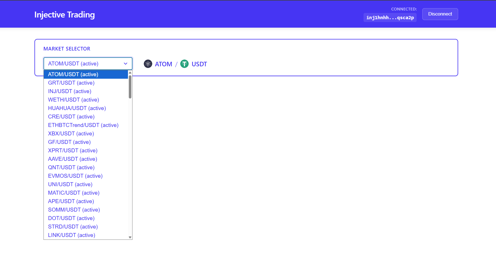
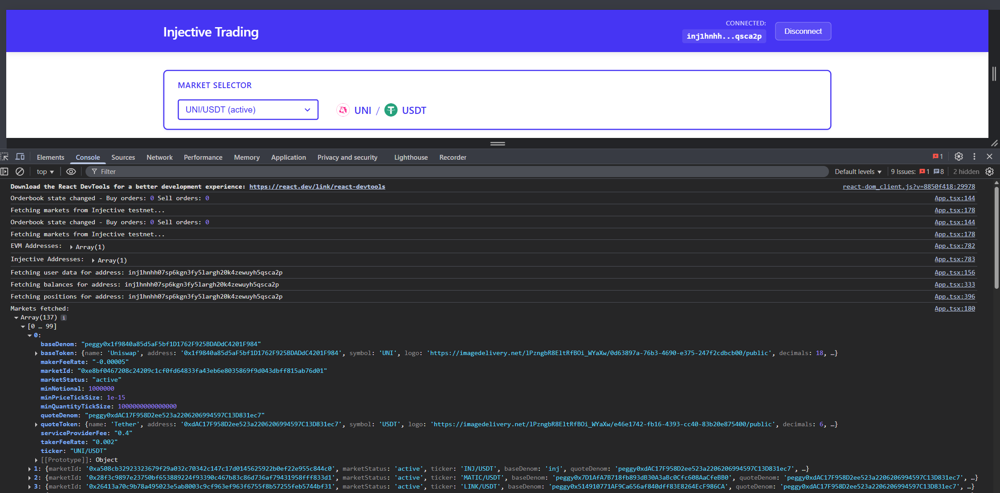
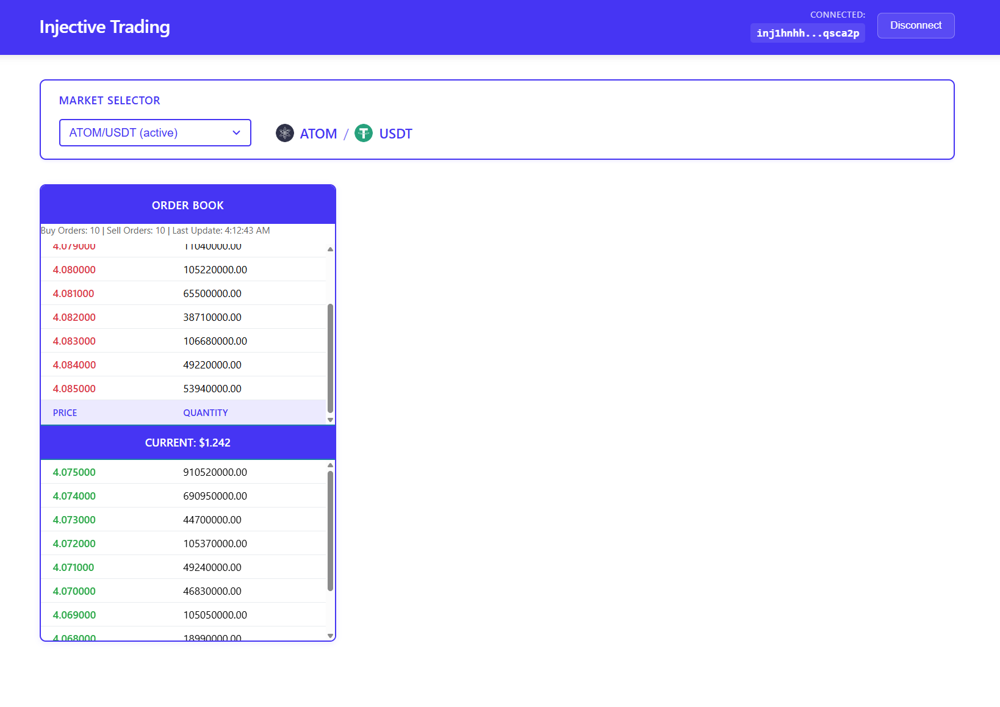
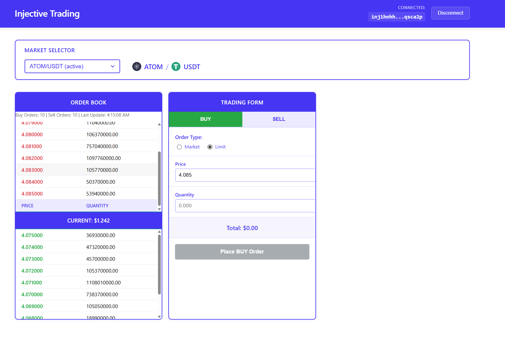

# Building a Spot Trading Interface on Injective Protocol

Welcome! In this tutorial, we're going to build a simple but fully functional trading interface on Injective Protocol from scratch. By the end, you'll have a React app where users can connect their MetaMask wallet, see live market data, browse real-time order books, and place actual trades on Injective's testnet.

Don't worry if you've never worked with blockchain protocols before - I'll walk you through every step and explain not just *what* we're doing, but *why* we're doing it. Think of this as us coding together!

## Table of Contents

- [Prerequisites](#prerequisites)
- [What We're Building](#what-were-building)
- [How This Will Work](#how-this-will-work)
- [Step 1: Setting Up Our Project](#step-1-setting-up-our-project)
- [Step 2: Connecting MetaMask Wallet](#step-2-connecting-metamask-wallet)
- [Step 3: Fetching Available Markets](#step-3-fetching-available-markets)
- [Step 4: Building a Live Order Book](#step-4-building-a-live-order-book)
- [Step 5: Creating Our Trading Form](#step-5-creating-our-trading-form)
- [Step 6: Making Orders Actually Work - Transaction Signing](#step-6-making-orders-actually-work---transaction-signing)
- [Step 7: Showing User Account Information](#step-7-showing-user-account-information)
- [Step 8: Making It Look Professional - Styling & Polish](#step-8-making-it-look-professional---styling--polish)
- [Conclusion](#conclusion)

## Prerequisites

Before we jump in, let's make sure you have everything you need. Don't worry - we won't need anything too fancy:

- **Node.js 18+** - We'll be using modern React features
- **Basic React knowledge** - You should be comfortable with hooks, state, and useEffect
- **MetaMask wallet** - Install it if you haven't already, and make sure it's configured
- **Basic trading concepts** - Know what buy/sell orders are and how order books work
- **Some TypeScript familiarity** - Helpful but not required; I'll explain as we go

If you're missing any of these, no worries! You can pick them up as we go along.

## Complete Code Repository

📁 **[View the complete source code on GitHub](https://github.com/Intellihackz/inject)**

This tutorial focuses on key concepts and important code snippets. For the complete implementation with all files, styling, and additional features, check out the repository above.

## What We're Building

Here's what your trading interface will be able to do by the end of this tutorial:

- **Connect MetaMask wallets** - Users can connect and see their Injective address
- **Browse live markets** - See all available trading pairs on Injective
- **View real-time order books** - Live buy/sell orders updating in real-time
- **Place actual trades** - Submit limit and market orders to the blockchain
- **Track balances** - See token balances and active positions
- **Handle transactions** - Sign and broadcast everything through MetaMask

Pretty cool, right? And we'll build it all from scratch so you understand every piece.

## How This Will Work

Let me quickly explain the architecture so you know what we're building:

**Frontend**: We'll use React with TypeScript for our user interface
**Blockchain**: All trading happens on Injective Protocol (we'll use testnet for safety)
**Wallet Connection**: MetaMask handles all the wallet interactions
**Real-time Data**: WebSocket connections give us live market data

The main tools we'll use are:

- `@injectivelabs/sdk-ts` - This is Injective's main SDK that handles everything
- `@injectivelabs/networks` - Network configuration for testnet/mainnet
- React hooks - For managing state and side effects
- Plain CSS - To make it look good

Alright, let's start building!

---

## Step 1: Setting Up Our Project

Alright, let's start building! The first thing we need to do is create a new React project and install Injective's SDK. I'll walk you through each step.

### Creating Our React App

Let's start by creating a fresh React TypeScript project using Vite. Open your terminal and run:

```bash
npm create vite@latest injective-trading
```

Select React and Typescript

```bash
cd injective-trading
npm install
```

This creates a new React app with TypeScript and Vite already configured. Vite is much faster than traditional bundlers and gives us a great development experience with instant hot reload!

### Installing Injective's SDK

Now we need to install Injective's TypeScript SDK. This is the magic package that gives us access to markets, order books, wallet connections, and everything else we need:

```bash
npm install @injectivelabs/sdk-ts @injectivelabs/networks
```

Let me explain what these packages do:

- **`@injectivelabs/sdk-ts`** - This is the main SDK with all the trading functions
- **`@injectivelabs/networks`** - This helps us configure whether we're using testnet or mainnet

### Setting Up Our App Structure

Let's start by setting up the basic structure of our trading interface. We'll create the main component that will house all our trading functionality.

First, let's set up our essential imports and types:

```tsx
// filepath: src/App.tsx
import {
  getInjectiveAddress,
  IndexerGrpcSpotApi,
  IndexerGrpcSpotStream,
  ChainRestBankApi,
  ChainGrpcExchangeApi,
  MsgCreateSpotLimitOrder,
  MsgCreateSpotMarketOrder,
} from "@injectivelabs/sdk-ts";
import { getNetworkEndpoints, Network } from "@injectivelabs/networks";
import { useState, useEffect, useRef } from "react";

// TypeScript interfaces for our data structures
interface TradingPair {
  ticker: string;
  baseToken: { symbol: string; decimals: number };
  quoteToken: { symbol: string; decimals: number };
  marketId: string;
  minPriceTickSize: string;
  minQuantityTickSize: string;
  priceTensMultiplier: number;
  quantityTensMultiplier: number;
}
```

Next, let's create our main component with the essential API clients:

```tsx
// filepath: src/App.tsx
function App() {
  // Initialize Injective API clients
  const endpoints = getNetworkEndpoints(Network.Testnet);
  const indexerGrpcSpotApi = new IndexerGrpcSpotApi(endpoints.indexer);
  const indexerGrpcSpotStream = new IndexerGrpcSpotStream(endpoints.indexer);
  const chainRestBankApi = new ChainRestBankApi(endpoints.rest);
  const chainGrpcExchangeApi = new ChainGrpcExchangeApi(endpoints.grpc);

  return (
    <div className="App">
      <h1>Injective Trading Interface</h1>
      <p>We're building something awesome!</p>
    </div>
  );
}

export default App;
```

Let me break down what's happening here:

**Network Configuration**:

```tsx
const endpoints = getNetworkEndpoints(Network.Testnet);
```

This line grabs all the API endpoints for Injective's testnet. When you're ready to go live, you'd just change `Network.Testnet` to `Network.Mainnet`.

**API Clients**: Those `new IndexerGrpcSpotApi()` lines create connections to different parts of Injective:

- `indexerGrpcSpotApi` - Gets market data and order books
- `indexerGrpcSpotStream` - Streams real-time updates  
- `chainRestBankApi` - Checks wallet balances
- `chainGrpcExchangeApi` - Get wallet trading positions

These clients map to Injective's documentation:

- `indexerGrpcSpotApi` - Gets market data and order books (see <https://docs.injective.network/developers-native/query-indexer/spot#fetch-markets>).

- `indexerGrpcSpotStream` - Streams real-time updates (see <https://docs.injective.network/developers-native/query-indexer-stream/spot#stream-the-spot-orderbook> ).

- `chainRestBankApi` - Checks wallet balances (see <https://docs.injective.network/developers-native/query-chain/bank#fetching-injective-addresss-balances>).

- `chainGrpcExchangeApi` - Handles trading operations (see <https://docs.injective.network/developers-native/query-chain/exchange#fetch-the-pending-trading-rewards-points-for-injective-addresses>).

Think of these as different phone lines to different departments at Injective HQ.

### Try It Out

Let's make sure everything is working. In your terminal, run:

```bash
npm run dev
```

You should see a basic React app with "Injective Trading Interface" at the top. If you see any errors, double-check that you installed the packages correctly.

Perfect! We now have a working React app with Injective's SDK ready to go. In the next step, we'll add wallet connection so users can actually connect their MetaMask wallet.

---

## Step 2: Connecting MetaMask Wallet

Now that we have our project set up, let's add the ability for users to connect their MetaMask wallet. This is where things get interesting - we need to handle the connection, convert addresses to work with Injective, and provide nice user feedback.

### Adding State for Wallet Connection

First, let's add some [React state variables](https://react.dev/reference/react/useState) to track our wallet connection. Add these to your `App` component, right after the API client setup:

```tsx
// filepath: src/App.tsx
import { useState } from "react";

function App() {
  // ... existing API client setup ...

  // State management using React's useState hook
  const [isConnected, setIsConnected] = useState(false);
  const [addresses, setAddresses] = useState<string[]>([]);
  const [injectiveAddresses, setInjectiveAddresses] = useState<string[]>([]);
  const [error, setError] = useState<string>("");
```

Here's what each of these [state variables](https://react.dev/learn/state-a-components-memory) does:

- `isConnected` - Simple boolean to track if a wallet is connected
- `addresses` - The actual Ethereum addresses from MetaMask
- `injectiveAddresses` - Those same addresses converted to Injective format (they're different!)
- `error` - Any error messages we want to show the user

### Building the Connection Logic

Now let's create the functions that handle connecting to MetaMask. Add these functions inside your `App` component:

**Important Note**: MetaMask and other EVM wallets inject a `window.ethereum` object into your browser when they're installed. This object is a standard interface that any EVM-compatible DApp can use to interact with the wallet. Even though we're building on Injective (not Ethereum - they're separate blockchains), Injective supports EVM wallets because it's EVM-compatible. This means we can use MetaMask to connect and sign transactions, then convert the addresses to work with Injective's blockchain.

```tsx
// filepath: src/App.tsx
// Helper function to safely access MetaMask
const getEthereum = () => {
  if (!window.ethereum) {
    throw new Error("MetaMask extension not installed");
  }
  return window.ethereum;
};

const connectWallet = async () => {
  try {
    setError(""); // Clear any previous errors
    const ethereum = getEthereum();
    
    // Ask MetaMask for permission to access accounts
    const evmAddresses = await ethereum.request({
      method: "eth_requestAccounts",
    });

    // Convert Ethereum addresses to Injective format
    const injAddresses = evmAddresses.map(getInjectiveAddress);

    // Update our state
    setAddresses(evmAddresses);
    setInjectiveAddresses(injAddresses);
    setIsConnected(true);

    console.log("Ethereum Address:", evmAddresses[0]);
    console.log("Injective Address:", injAddresses[0]);
  } catch (err) {
    setError(err instanceof Error ? err.message : "Failed to connect wallet");
    setIsConnected(false);
  }
};

const disconnectWallet = () => {
  setIsConnected(false);
  setAddresses([]);
  setInjectiveAddresses([]);
  setError("");
};
```

The most important part here is the address conversion. Ethereum addresses (like `0x1234...`) need to be converted to Injective's format (like `inj1234...`) - that's what `getInjectiveAddress()` does for us.

For example, the Ethereum address `0xbcef77fa01d59138a494ff468ba9f6a8b2ee12f4` converts to the Injective address `inj1hnhh07sp6kgn3fy5largh20k4zewuyh5qsca2p`. They represent the same wallet, just in different formats for their respective blockchains.

### Creating the UI

Now let's create a nice header with a connect/disconnect button. First, add this helper function:

```typescript
// Helper to make long addresses more readable
const formatAddress = (address: string) => {
  if (!address) return "";
  return `${address.slice(0, 8)}...${address.slice(-6)}`;
};
```

Then update your JSX return to include this header:

```typescript
return (
  <div className="App">
    <header className="header">
      <div className="header-container">
        <div className="logo">
          <h2>Injective Trading</h2>
        </div>
        {!isConnected ? (
          <button className="connect-button" onClick={connectWallet}>
            Connect Wallet
          </button>
        ) : (
          <div className="wallet-info-header">
            <div className="connected-address">
              <span className="address-label">Connected:</span>
              <span className="address-text" title={injectiveAddresses[0] || ""}>
                {formatAddress(injectiveAddresses[0] || "")}
              </span>
            </div>
            <button className="disconnect-button" onClick={disconnectWallet}>
              Disconnect
            </button>
          </div>
        )}
      </div>
    </header>
    
    {error && (
      <div className="error-message">
        {error}
      </div>
    )}
    
    <main>
      <h1>We're building something awesome!</h1>
      {isConnected && (
        <p>✅ Wallet connected! Address: {formatAddress(injectiveAddresses[0] || "")}</p>
      )}
    </main>
  </div>
);
```

### Test the Connection

Save your file and check your browser. You should now see a "Connect Wallet" button. When you click it:

1. MetaMask should pop up asking for permission
2. After approving, you'll see your connected address in the header
3. Check the browser console to see both your Ethereum and Injective addresses

Pretty cool! The key thing to understand here is that we're taking your regular Ethereum address from MetaMask and converting it to work with Injective's blockchain. Same wallet, different format.

Next up, we'll start fetching real market data from Injective so users can see what's available to trade!

- **Error Handling**: Always wrap wallet interactions in try-catch blocks
- **State Management**: Keep wallet connection state synchronized

---

## Step 3: Fetching Available Markets

Great! Now we have wallet connection working. Let's make our trading interface actually useful by fetching real market data from Injective. This is where we'll see what trading pairs are available - like INJ/USDT, ATOM/USDT, etc.

### Setting Up Market Data Types

First, let's define what a trading pair looks like. This helps TypeScript understand our data structure and catches errors early:

```tsx
// filepath: src/App.tsx
interface TradingPair {
  marketId: string;
  ticker: string;
  baseDenom: string;
  quoteDenom: string;
  marketStatus: string;
  baseToken?: {
    name: string;
    symbol: string;
    decimals: number;
  };
  quoteToken?: {
    name: string;
    symbol: string;
    decimals: number;
  };
}
```

The important fields here are `ticker` (like "INJ/USDT"), `marketId` (unique identifier), and `marketStatus` (whether it's active).

### Adding State for Markets

Now let's add some [React state variables](https://react.dev/reference/react/useState) to track our market data:

```tsx
// filepath: src/App.tsx
// Add these with your other state variables
const [selectedPair, setSelectedPair] = useState<string>("");
const [tradingPairs, setTradingPairs] = useState<TradingPair[]>([]);
const [marketsLoading, setMarketsLoading] = useState(true);
const [marketsError, setMarketsError] = useState<string>("");
```

Here's what each does:

- `selectedPair` - Which trading pair the user has chosen (like "INJ/USDT")
- `tradingPairs` - Array of all available markets
- `marketsLoading` - Show loading state while fetching
- `marketsError` - Any errors that happen while fetching

### Fetching Markets from Injective

Now for the exciting part - let's actually fetch real market data! We'll use [React's useEffect hook](https://react.dev/reference/react/useEffect) to load this data when the component first renders:

```tsx
// filepath: src/App.tsx
import { useEffect } from "react";

// Add this useEffect inside your App component
useEffect(() => {
  const fetchMarkets = async () => {
    try {
      setMarketsLoading(true);
      setMarketsError("");

      console.log("Fetching markets from Injective testnet...");
      const markets = await indexerGrpcSpotApi.fetchMarkets();
      
      // Clean up the data for easier use
      const formattedMarkets: TradingPair[] = markets.map((market) => ({
        marketId: market.marketId,
        ticker: market.ticker,
        baseDenom: market.baseDenom,
        quoteDenom: market.quoteDenom,
        marketStatus: market.marketStatus,
        baseToken: market.baseToken,
        quoteToken: market.quoteToken,
      }));

      setTradingPairs(formattedMarkets);

      // Pick the first market as default
      if (formattedMarkets.length > 0 && !selectedPair) {
        setSelectedPair(formattedMarkets[0].ticker);
      }
    } catch (err) {
      console.error("Error fetching markets:", err);
      setMarketsError(
        err instanceof Error ? err.message : "Failed to fetch markets"
      );
    } finally {
      setMarketsLoading(false);
    }
  };

  fetchMarkets();
}, []); // Empty dependency array means this runs once when component mounts
```

This function:

1. **Calls Injective's API** to get all available spot markets
2. **Formats the data** into our TypeScript interface  
3. **Handles errors** gracefully if something goes wrong
4. **Sets a default selection** so users don't see an empty dropdown

### Creating the Market Selector UI

Now let's create a dropdown where users can choose which market to trade. Add this helper function first:

```typescript
// filepath: src/App.tsx
const getCurrentPairData = () => {
  return (
    tradingPairs.find((pair) => pair.ticker === selectedPair) ||
    tradingPairs[0]
  );
};
```

Then update your JSX to include the market selector. Add this after your header:

```typescript
// filepath: src/App.tsx
<div className="market-selector">
  <h3>Choose Market</h3>
  {marketsLoading ? (
    <div className="loading-message">Loading markets...</div>
  ) : marketsError ? (
    <div className="error-message">
      Error loading markets: {marketsError}
    </div>
  ) : (
    <div className="market-controls">
      <select
        value={selectedPair}
        onChange={(e) => setSelectedPair(e.target.value)}
        className="pair-select"
        disabled={tradingPairs.length === 0}
      >
        {tradingPairs.map((pair) => (
          <option key={pair.marketId} value={pair.ticker}>
            {pair.ticker} ({pair.marketStatus})
          </option>
        ))}
      </select>
    </div>
  )}
</div>
```

### Testing Your Market Data

Save your file and check your browser. You should now see:

1. A "Choose Market" section with a dropdown
2. Real trading pairs from Injective testnet (like INJ/USDT, ATOM/USDT)
3. Each option shows the market status (like "active")


*Your market selector should look like this - a clean dropdown showing available trading pairs*

Check your browser console too - you'll see the full market data being logged. To open the console: press **F12** (or **Ctrl+Shift+I** on Windows/Linux, **Cmd+Option+I** on Mac), then click the "Console" tab.


*The browser console shows all the market data being fetched from Injective's blockchain*

Pretty cool that we're pulling real data from a live blockchain!

The key thing to understand here is that we're not just showing dummy data - these are actual trading pairs that people are using to trade on Injective right now. In the next step, we'll start showing real-time order book data for whichever market the user selects.

- **Error Handling**: Always handle loading and error states for better UX
- **Default Selection**: Set a default market to prevent undefined state

---

## Step 4: Building a Live Order Book

This is where things get really exciting! We're going to create a live order book that shows real buy and sell orders updating in real-time. Imagine watching the actual heartbeat of trading on Injective - that's what we're building.

### Important Performance Pattern: Fetch First, Then Stream

A critical best practice when working with order books is to **fetch the initial snapshot first**, then connect to the real-time stream. This pattern:

- Provides immediate data to users (better UX)
- Prevents race conditions between initial load and stream setup
- Ensures you always have a complete orderbook state

Here's the recommended pattern from Injective's documentation:

```tsx
// First, fetch the initial orderbook snapshot
const initialOrderbook = await indexerGrpcSpotApi.fetchOrderbookV2(marketId);
processOrderbookData(initialOrderbook);

// Then setup the stream for real-time updates
const stream = indexerGrpcSpotStream.streamSpotOrderbookV2({
  marketIds: [marketId],
  callback: processOrderbookData,
});
```

### Understanding Order Books

Before we code, let me quickly explain what an order book is. It's basically two lists:

- **Buy orders (bids)** - People wanting to buy, sorted from highest price to lowest
- **Sell orders (asks)** - People wanting to sell, sorted from lowest price to highest

The gap between the highest buy price and lowest sell price is called the "spread."

**Important Note**: Most blockchain DEXs (decentralized exchanges) use AMM (Automated Market Maker) formulas for trading, where prices are determined algorithmically by liquidity pools. However, Injective uses a fully **on-chain order book** - the same mechanism used by traditional finance platforms like stock exchanges (NYSE, NASDAQ). This gives traders more control over their entry and exit prices, better price discovery, and the ability to place limit orders, just like professional trading platforms.

**learn more about orderbooks** Check out [Investopedia's guide to order books](https://www.investopedia.com/terms/o/order-book.asp) for a deeper dive into order book mechanics

### Setting Up Order Book Types

Let's define what an order book entry looks like:

```tsx
// filepath: src/App.tsx
interface OrderBookEntry {
  price: string;
  quantity: string;
  timestamp: number;
}
```

### Adding State for the Order Book

Now let's add [React state variables](https://react.dev/reference/react/useState) to track our order book data:

```tsx
// filepath: src/App.tsx
import { useRef } from "react";

// Add these state variables
const [buyOrders, setBuyOrders] = useState<OrderBookEntry[]>([]);
const [sellOrders, setSellOrders] = useState<OrderBookEntry[]>([]);
const [orderbookLoading, setOrderbookLoading] = useState(true);
const [currentPrice, setCurrentPrice] = useState<number>(0);

// Ref for managing WebSocket connections
const streamRef = useRef<any>(null);
```

Learn more about [useRef](https://react.dev/reference/react/useRef) for managing WebSocket connections.

### Creating the Real-Time Stream

Now for the cool part - let's connect to Injective's real-time order book stream! We'll use [React's useEffect](https://react.dev/reference/react/useEffect) to manage the WebSocket connection, following the best practice of fetching initial data first:

```tsx
// filepath: src/App.tsx
useEffect(() => {
  if (!selectedPair || tradingPairs.length === 0) return;

  const currentMarket = getCurrentPairData();
  if (!currentMarket) return;

  console.log("Fetching initial orderbook and starting stream for market:", currentMarket.marketId);
  setOrderbookLoading(true);

  // Shared function to process orderbook data from both initial fetch and stream
  const processOrderbookData = (orderbooks: any) => {
    try {
      const orderbook = orderbooks?.orderbook || orderbooks;
      
      if (orderbook && (orderbook.buys || orderbook.sells)) {
        // Process buy orders (top 10)
        const processedBuyOrders: OrderBookEntry[] = orderbook.buys
          ? orderbook.buys.slice(0, 10).map((order: any) => ({
              price: order.price,
              quantity: order.quantity,
              timestamp: order.timestamp || Date.now(),
            }))
          : [];

        // Process sell orders (top 10)
        const processedSellOrders: OrderBookEntry[] = orderbook.sells
          ? orderbook.sells.slice(0, 10).map((order: any) => ({
              price: order.price,
              quantity: order.quantity,
              timestamp: order.timestamp || Date.now(),
            }))
          : [];

        setBuyOrders(processedBuyOrders);
        setSellOrders(processedSellOrders);
        
        // Calculate current market price (mid-price between best bid and ask)
        if (processedBuyOrders.length > 0 && processedSellOrders.length > 0) {
          const bestBid = parseFloat(processedBuyOrders[0].price);
          const bestAsk = parseFloat(processedSellOrders[0].price);
          const midPrice = (bestBid + bestAsk) / 2;
          setCurrentPrice(midPrice);
          console.log(`Current price updated: ${midPrice} (Bid: ${bestBid}, Ask: ${bestAsk})`);
        } else if (processedBuyOrders.length > 0) {
          setCurrentPrice(parseFloat(processedBuyOrders[0].price));
        } else if (processedSellOrders.length > 0) {
          setCurrentPrice(parseFloat(processedSellOrders[0].price));
        }
        
        setOrderbookLoading(false);
      }
    } catch (err) {
      console.error("Error processing orderbook data:", err);
      setOrderbookLoading(false);
    }
  };

  // First, fetch the initial orderbook snapshot
  const fetchInitialOrderbook = async () => {
    try {
      console.log("Fetching initial orderbook snapshot...");
      const initialOrderbook = await indexerGrpcSpotApi.fetchOrderbookV2(
        currentMarket.marketId
      );
      console.log("Initial orderbook fetched:", initialOrderbook);
      processOrderbookData(initialOrderbook);
    } catch (err) {
      console.error("Error fetching initial orderbook:", err);
      setOrderbookLoading(false);
    }
  };

  // Fetch initial data
  fetchInitialOrderbook();

  // Then setup the stream for real-time updates
  const streamFn = indexerGrpcSpotStream.streamSpotOrderbookV2.bind(
    indexerGrpcSpotStream
  );

  const streamCallback = (orderbooks: any) => {
    console.log("Received orderbook stream update");
    processOrderbookData(orderbooks);
  };

  try {
    streamRef.current = streamFn({
      marketIds: [currentMarket.marketId],
      callback: streamCallback,
    });
  } catch (err) {
    console.error("Error starting orderbook stream:", err);
  }

  // Cleanup function - important for WebSockets!
  return () => {
    if (streamRef.current) {
      console.log("Cleaning up orderbook stream");
      streamRef.current = null;
    }
  };
}, [selectedPair, tradingPairs]);
```

This implementation:

1. **Fetches initial data** immediately for instant display
2. **Processes data** using a shared function for consistency
3. **Sets up streaming** for real-time updates after initial data loads
4. **Calculates** the current market price dynamically
5. **Cleans up** properly when the component unmounts or market changes

### Why This Pattern Matters

The fetch-first-then-stream pattern prevents common issues:

- **No race conditions**: Initial data loads before stream starts
- **Better UX**: Users see data immediately instead of waiting for first stream update
- **Consistent state**: Shared processing function ensures data format consistency

### Smart Price Formatting for Tiny Numbers

Before we build the UI, let's add a smart price formatting function. Many tokens (especially memecoins) have very small prices like `0.00005753`, which would normally display as `0.000058` when rounded. Professional DEX platforms like DexScreener use **subscript notation** to compress leading zeros:

- `0.00005753` → `0.0₄5753` (the ₄ means "4 zeros after the decimal")
- `0.00000002001` → `0.0₇2001` (the ₇ means "7 zeros")

This keeps the display clean while preserving significant digits. Add this function at the top level of your App.tsx:

```typescript
// filepath: src/App.tsx
// Format small prices with leading zero compression (like DexScreener)
const formatSmallPrice = (price: number, quoteSymbol: string = "$"): string => {
  if (price === 0) return `${quoteSymbol}0.00`;
  if (price >= 0.0001) {
    return `${price.toFixed(4)}`;
  }
  
  // Convert to string to count leading zeros
  const priceStr = price.toFixed(20).replace(/\.?0+$/, ''); // Remove trailing zeros
  const match = priceStr.match(/^0\.0+/);
  
  if (!match) return `${price}`;
  
  const leadingZeros = match[0].length - 2; // Subtract "0."
  
  // Limit to max 9 leading zeros (prevents subscript going beyond single digits)
  if (leadingZeros > 9) {
    const adjustedZeros = Math.min(leadingZeros, 9);
    const startPos = match[0].length + (leadingZeros - adjustedZeros);
    const significantDigits = priceStr.slice(startPos).slice(0, 4);
    
    const subscripts = ['₀', '₁', '₂', '₃', '₄', '₅', '₆', '₇', '₈', '₉'];
    const zeroCount = adjustedZeros.toString().split('').map(d => subscripts[parseInt(d)]).join('');
    
    return `0.0${zeroCount}${significantDigits}`;
  }
  
  const significantDigits = priceStr.slice(match[0].length).slice(0, 4);
  
  // Use subscript numbers: ₀₁₂₃₄₅₆₇₈₉
  const subscripts = ['₀', '₁', '₂', '₃', '₄', '₅', '₆', '₇', '₈', '₉'];
  const zeroCount = leadingZeros.toString().split('').map(d => subscripts[parseInt(d)]).join('');
  
  return `0.0${zeroCount}${significantDigits}`;
};
```

We'll also need a helper to get the quote token symbol (INJ, USDT, etc.) dynamically:

```typescript
// filepath: src/App.tsx
const getQuoteSymbol = () => {
  const currentMarket = getCurrentPairData();
  return currentMarket?.quoteToken?.symbol || "$";
};
```

**Why This Matters**: Without this formatting, a price like `0.00000000007` would display as `0.00000` (misleading) or take up massive screen space. With subscript compression, it displays as `0.0₁₀7` - clean and accurate!

### Building the Order Book UI

Now let's create the visual order book with our smart price formatting. First, add a helper function for when users click on prices:

```typescript
// filepath: src/App.tsx
const handlePriceClick = (clickedPrice: string) => {
  setPrice(clickedPrice); // We'll add this state variable in the next step
};
```

Then add this to your JSX after the market selector:

```typescript
// filepath: src/App.tsx
<div className="order-book">
  <h3>Live Order Book</h3>

  {orderbookLoading ? (
    <div className="loading-message">Loading order book...</div>
  ) : (
    <>
      {/* Sell Orders (Asks) - shown at top in red */}
      <div className="sell-orders">
        <div className="order-header">
          <span>Price</span>
          <span>Quantity</span>
        </div>
        {sellOrders
          .slice()
          .reverse() // Reverse so lowest price is closest to center
          .map((order, index) => (
            <div
              key={`sell-${index}`}
              className="order-row sell-order"
              onClick={() => handlePriceClick(order.price)}
              style={{ color: '#f44336', cursor: 'pointer' }}
            >
              <span className="price">
                {/* Use smart formatting - shows 0.0₄5753 instead of 0.00005753 */}
                {formatSmallPrice(parseFloat(order.price), getQuoteSymbol())}
              </span>
              <span className="quantity">
                {parseFloat(order.quantity).toFixed(2)}
              </span>
            </div>
          ))}
        {sellOrders.length === 0 && (
          <div className="no-orders">No sell orders</div>
        )}
      </div>

      {/* Current Price Display - dynamically shows correct quote token */}
      <div className="current-price" style={{ 
        textAlign: 'center', 
        padding: '10px',
        background: '#f0f0f0',
        margin: '10px 0',
        fontWeight: 'bold'
      }}>
        {currentPrice > 0 
          ? `${formatSmallPrice(currentPrice, getQuoteSymbol())} ${getQuoteSymbol()}` 
          : 'CURRENT: --'}
      </div>

      {/* Buy Orders (Bids) - shown at bottom in green */}
      <div className="buy-orders">
        {buyOrders.map((order, index) => (
          <div
            key={`buy-${index}`}
            className="order-row buy-order"
            onClick={() => handlePriceClick(order.price)}
            style={{ color: '#4CAF50', cursor: 'pointer' }}
          >
            <span className="price">
              {/* Smart formatting for tiny prices */}
              {formatSmallPrice(parseFloat(order.price), getQuoteSymbol())}
            </span>
            <span className="quantity">
              {parseFloat(order.quantity).toFixed(2)}
            </span>
          </div>
        ))}
        {buyOrders.length === 0 && (
          <div className="no-orders">No buy orders</div>
        )}
      </div>
    </>
  )}
</div>
```

### Test Your Live Order Book

Save your file and check your browser. You should now see:

1. A "Live Order Book" section
2. Real sell orders (in red) at the top
3. Current market price in the middle
4. Real buy orders (in green) at the bottom
5. Orders updating in real-time as the market moves!


*Your live order book should display real-time buy and sell orders with prices updating as the market moves*

Try clicking on different prices - we'll use this feature in the next step to auto-fill trade forms.

This is incredibly cool - you're now showing real-time order book data from actual traders on Injective! The numbers you see are real people's buy and sell orders, formatted intelligently to handle everything from regular prices to tiny memecoin prices. Notice how:

- **Tiny prices** like `0.00005753` display as `0.0₄5753` (clean and readable)
- **Quote tokens** show dynamically (INJ, USDT, etc.) based on the selected market
- **Current price** updates in real-time as the market moves

In the next step, we'll build a trading form so users can place their own orders into this same order book.

---

## Step 5: Creating Our Trading Form

Excellent! Now that we have live market data and a real-time order book, it's time to build the heart of our trading interface - the form where users can actually place orders. This is where the magic happens!

### Understanding Trading Forms

Before we dive into the code, let me explain the key concepts we'll be working with:

- **Order Side**: Whether you're buying (going long) or selling (going short)
- **Order Type**: Market orders (execute immediately) vs Limit orders (wait for specific price)
- **Price**: For limit orders, what price you want to buy/sell at
- **Quantity**: How much of the asset you want to trade

Think of it like placing an order at a restaurant - you specify what you want (quantity), how you want it prepared (order type), and what you're willing to pay (price).

### Setting Up Our Form State

First, let's define the types and state variables we'll need. Add these type definitions at the top of your file with the other interfaces:

```typescript
// filepath: src/App.tsx
type OrderSide = "buy" | "sell";
type OrderType = "market" | "limit";
```

Now add these state variables with your other state declarations:

```typescript
// filepath: src/App.tsx
const [orderSide, setOrderSide] = useState<OrderSide>("buy");
const [orderType, setOrderType] = useState<OrderType>("limit");
const [price, setPrice] = useState<string>("");
const [quantity, setQuantity] = useState<string>("");
```

Here's what each state variable does:

- `orderSide` - Whether user wants to buy or sell (starts with "buy" as default)
- `orderType` - Market order (executes immediately) or limit order (waits for price)
- `price` - The price user wants to buy/sell at (for limit orders)
- `quantity` - How much they want to trade

### Adding Smart Calculations

Let's create a helper function that automatically calculates the total cost of the order. This gives users instant feedback about how much they're about to spend:

```typescript
// filepath: src/App.tsx
const calculateTotal = () => {
  const priceNum = parseFloat(price || "0");
  const quantityNum = parseFloat(quantity || "0");
  return (priceNum * quantityNum).toFixed(2);
};
```

We'll also add some smart form behavior - when users change any form values, we'll clear any previous success/error messages. Add this `useEffect`:

```typescript
// filepath: src/App.tsx
// Clear order messages when form values change
useEffect(() => {
  if (orderError || orderSuccess) {
    clearOrderMessages(); // We'll define this function soon
  }
}, [price, quantity, orderSide, orderType, selectedPair]);
```

This creates a smooth user experience - old messages don't stick around when users are making new orders.

### Building the Trading Form UI

Now for the fun part - let's build the actual form! This will be a comprehensive trading interface with tabs, inputs, and smart validation. Add this to your JSX after the order book:

```typescript
// filepath: src/App.tsx
<div className="trading-form">
  <h3>Place Your Trade</h3>

  {/* Buy/Sell Selection - These tabs let users choose their order direction */}
  <div className="order-side-tabs">
    <button
      className={`tab ${orderSide === "buy" ? "active" : ""}`}
      onClick={() => setOrderSide("buy")}
    >
      BUY
    </button>
    <button
      className={`tab ${orderSide === "sell" ? "active" : ""}`}
      onClick={() => setOrderSide("sell")}
    >
      SELL
    </button>
  </div>

  {/* Order Type Selection - Market vs Limit orders */}
  <div className="order-type-toggle">
    <label>Order Type:</label>
    <div className="radio-group">
      <label>
        <input
          type="radio"
          value="market"
          checked={orderType === "market"}
          onChange={() => setOrderType("market")}
        />
        Market (Execute Now)
      </label>
      <label>
        <input
          type="radio"
          value="limit"
          checked={orderType === "limit"}
          onChange={() => setOrderType("limit")}
        />
        Limit (Wait for Price)
      </label>
    </div>
  </div>

  {/* Price Input - Only shown for limit orders */}
  <div className="input-group">
    <label>
      {orderType === "limit" ? "Limit Price" : "Market Price (Auto)"}
    </label>
    <input
      type="number"
      value={price}
      onChange={(e) => setPrice(e.target.value)}
      disabled={orderType === "market"}
      placeholder="0.000000"
      step="0.000001"
    />
    {orderType === "market" && (
      <small style={{ color: "#666", fontSize: "0.8rem" }}>
        Market orders execute at the best available price
      </small>
    )}
  </div>

  {/* Quantity Input - How much to buy/sell */}
  <div className="input-group">
    <label>Quantity</label>
    <input
      type="number"
      value={quantity}
      onChange={(e) => setQuantity(e.target.value)}
      placeholder="0.000000"
      step="0.000001"
    />
  </div>

  {/* Total Cost Display - Real-time calculation */}
  <div className="total-display">
    <span>
      Estimated Total: ${calculateTotal()}
      {orderType === "market" && " (approximate)"}
    </span>
  </div>

  {/* Place Order Button - The main action button */}
  <button
    className={`place-order-btn ${orderSide}`}
    onClick={handlePlaceOrder} // We'll define this in the next step!
    disabled={
      isPlacingOrder ||
      !quantity ||
      (orderType === "limit" && !price) ||
      !isConnected
    }
  >
    {isPlacingOrder ? (
      <span>Placing Order...</span>
    ) : (
      `Place ${orderSide.toUpperCase()} Order`
    )}
  </button>

  {/* Helpful message when wallet isn't connected */}
  {!isConnected && (
    <div style={{ 
      padding: "0.5rem 1rem", 
      textAlign: "center", 
      fontSize: "0.8rem", 
      color: "#666", 
      fontStyle: "italic" 
    }}>
      Connect your wallet to start trading
    </div>
  )}
</div>
```

### Understanding the Form Logic

Let me break down what makes this form special:

**Smart Input Validation**: The place order button is automatically disabled when:

- Required fields are empty (quantity always, price for limit orders)
- User hasn't connected their wallet
- An order is already being placed (prevents double-clicking)

**Dynamic Labels**: Notice how the price input label changes based on order type - "Limit Price" for limit orders, "Market Price (Auto)" for market orders.

**Real-time Feedback**: The total cost updates instantly as users type, and we show approximation warnings for market orders since their final price isn't guaranteed.

**User-Friendly Design**: We use clear labels like "Execute Now" vs "Wait for Price" instead of just "Market" vs "Limit" - this helps users who aren't familiar with trading terminology.

### Connecting to Order Book Prices

Remember that `handlePriceClick` function we added to the order book? Now it becomes really useful! When users click on any price in the order book, it automatically fills in the price field of our form. This creates a seamless trading experience - users can see a price they like and immediately start building an order.

You'll notice we also have an `orderError` and `orderSuccess` state mentioned in the code. Don't worry about those yet - we'll add those in the next step when we implement the actual order placement logic.

### Testing Your Form

Save your file and check your browser. You should now see a complete trading form with:

1. **Buy/Sell tabs** that change the button color
2. **Order type radio buttons** that disable/enable the price input
3. **Smart validation** that prevents invalid orders
4. **Real-time total calculation** showing the cost
5. **Connection status** that shows helpful messages


*Your trading form should display with buy/sell tabs, order type options, price and quantity inputs, and a dynamic place order button*

Try switching between market and limit orders to see how the form adapts. The price input should disable for market orders since they execute at whatever the current market price is.

Next up, we'll implement the actual order placement logic - this is where we'll interact with Injective's blockchain to submit real trades!

---

## Step 6: Making Orders Actually Work - Transaction Signing

This is the exciting part where we connect our beautiful form to the actual blockchain! When users click "Place Order," we need to create a proper blockchain transaction, get it signed by MetaMask, and broadcast it to Injective.

### Understanding Blockchain Trading

Before we code, let me explain what happens when you place a trading order on a blockchain:

1. **Create the Message** - We build a transaction message with all the order details
2. **Calculate Fees** - Every blockchain transaction requires gas fees
3. **Sign with Wallet** - MetaMask signs the transaction to prove it's really from you
4. **Broadcast** - We send the signed transaction to Injective's network
5. **Confirmation** - The blockchain processes it and gives us a transaction hash

Think of it like writing a cheque - you fill in the amount and recipient, sign it to authorize the payment, mail it to the payee, and the bank processes it to complete the transaction.

### Step 6a: Setting Up Order State

First, let's add the [React state variables](https://react.dev/reference/react/useState) we need to track the order process:

```tsx
// filepath: src/App.tsx
// Add these with your other state declarations
const [isPlacingOrder, setIsPlacingOrder] = useState(false);
const [orderError, setOrderError] = useState<string>("");
const [orderSuccess, setOrderSuccess] = useState<string>("");
```

These track:

- `isPlacingOrder` - Show loading state while order is being processed
- `orderError` - Any error messages to show the user
- `orderSuccess` - Success message with transaction details

### Step 6b: Order Validation and Setup

Let's start building our order placement function with proper validation:

```tsx
// filepath: src/App.tsx
const handlePlaceOrder = async () => {
  // Validation checks
  if (!price && orderType === "limit") return;
  if (!quantity) return;
  if (!isConnected || injectiveAddresses.length === 0) {
    setOrderError("Please connect your wallet first");
    return;
  }

  const currentMarket = getCurrentPairData();
  if (!currentMarket) {
    setOrderError("Please select a market first");
    return;
  }

  try {
    setIsPlacingOrder(true);
    setOrderError("");
    setOrderSuccess("");

    console.log("Starting order placement process...");
    
    const injectiveAddress = injectiveAddresses[0];
    // ... rest of the function will be broken down below
  } catch (err) {
    console.error("Order placement failed:", err);
    setOrderError(err instanceof Error ? err.message : "Failed to place order");
  } finally {
    setIsPlacingOrder(false);
  }
};
```

### Step 6c: Market Information and Multipliers

Next, we need to prepare the market information and mathematical multipliers for price conversion:

```tsx
// filepath: src/App.tsx
// Inside the try block of handlePlaceOrder
// Prepare market information
const market = {
  marketId: currentMarket.marketId,
  baseDecimals: currentMarket.baseToken?.decimals || 18,
  quoteDecimals: currentMarket.quoteToken?.decimals || 6,
  minPriceTickSize: currentMarket.minPriceTickSize,
  minQuantityTickSize: currentMarket.minQuantityTickSize,
};

// Get mathematical multipliers for price/quantity conversion
const tensMultipliers = getSpotMarketTensMultiplier({
  baseDecimals: market.baseDecimals,
  quoteDecimals: market.quoteDecimals,
  minPriceTickSize: market.minPriceTickSize,
  minQuantityTickSize: market.minQuantityTickSize,
});

const marketWithMultipliers = {
  ...market,
  priceTensMultiplier: tensMultipliers.priceTensMultiplier,
  quantityTensMultiplier: tensMultipliers.quantityTensMultiplier,
};
```

### Step 6d: Creating Order Messages

Now we'll create the order message for the blockchain:

```tsx
// filepath: src/App.tsx
// Create subaccount ID (your trading account on Injective)
const ethereumAddress = getEthereumAddress(injectiveAddress);
const subaccountIndex = 0; // Most users use subaccount 0
const suffix = "0".repeat(23) + subaccountIndex;
const subaccountId = ethereumAddress + suffix;

// Determine order details
const orderTypeValue = orderSide === "buy" ? 1 : 2; // 1 = Buy, 2 = Sell
const feeRecipient = injectiveAddress;

let msg; // This will hold our order message

if (orderType === "limit") {
  // Convert user-friendly numbers to blockchain format
  const chainPrice = spotPriceToChainPriceToFixed({
    value: parseFloat(price),
    tensMultiplier: marketWithMultipliers.priceTensMultiplier,
    baseDecimals: marketWithMultipliers.baseDecimals,
    quoteDecimals: marketWithMultipliers.quoteDecimals,
  });

  const chainQuantity = spotQuantityToChainQuantityToFixed({
    value: parseFloat(quantity),
    tensMultiplier: marketWithMultipliers.quantityTensMultiplier,
    baseDecimals: marketWithMultipliers.baseDecimals,
  });

  // Create the limit order message
  msg = MsgCreateSpotLimitOrder.fromJSON({
    subaccountId,
    injectiveAddress,
    orderType: orderTypeValue,
    price: chainPrice,
    quantity: chainQuantity,
    marketId: marketWithMultipliers.marketId,
    feeRecipient: feeRecipient,
  });
} else {
  // Market order logic (similar pattern)
  // ... see complete implementation in repository
}
```

For the complete `handlePlaceOrder` function including transaction creation, signing, and broadcasting, check the [full implementation in the repository](https://github.com/Intellihackz/injective-trading-app-tutorial/blob/main/src/App.tsx).

### Adding Message Display Components

Now we need to show success and error messages to users. Add this helper function:

```typescript
// filepath: src/App.tsx
const clearOrderMessages = () => {
  setOrderError("");
  setOrderSuccess("");
};
```

And add these message components to your trading form JSX (after the place order button):

```typescript
// filepath: src/App.tsx
{orderError && (
  <div className="order-error" style={{
    padding: "0.5rem 1rem",
    background: "#fee",
    color: "#c53030",
    fontSize: "0.85rem",
    borderRadius: "4px",
    margin: "0.5rem 1rem",
    border: "1px solid #fed7d7",
  }}>
    <strong>Error:</strong> {orderError}
    <button onClick={clearOrderMessages} style={{
      float: "right",
      background: "none",
      border: "none",
      color: "#c53030",
      cursor: "pointer",
      fontSize: "0.8rem",
    }}>
      ✕
    </button>
  </div>
)}

{orderSuccess && (
  <div className="order-success" style={{
    padding: "0.5rem 1rem",
    background: "#f0fff4",
    color: "#22543d",
    fontSize: "0.8rem",
    borderRadius: "4px",
    margin: "0.5rem 1rem",
    border: "1px solid #9ae6b4",
    whiteSpace: "pre-line", // This makes line breaks work in the success message
  }}>
    <strong>Success:</strong> {orderSuccess}
    <button onClick={clearOrderMessages} style={{
      float: "right",
      background: "none",
      border: "none",
      color: "#22543d",
      cursor: "pointer",
      fontSize: "0.8rem",
    }}>
      ✕
    </button>
  </div>
)}
```

### What Just Happened?

This is a lot of code, but here's what each part does:

1. **Validation**: Make sure we have all required inputs
2. **Market Setup**: Prepare the trading pair information  
3. **Format Conversion**: Convert user prices/quantities to blockchain format
4. **Message Creation**: Build the actual order message for the blockchain
5. **Account Info**: Get your account's sequence number (like a check number)
6. **Transaction Building**: Package everything into a transaction
7. **Signing**: Use MetaMask to cryptographically sign the transaction
8. **Broadcasting**: Send it to Injective's network
9. **Confirmation**: Wait for the blockchain to process it

The most complex parts are the price/quantity conversions - blockchains store numbers very differently than humans read them!

### Test Your Order System

Save your file and try placing a small test order (make sure you have some testnet INJ for gas fees). The process should be:

1. Fill out the trading form
2. Click "Place Order"
3. MetaMask pops up asking you to sign
4. Success message shows with transaction hash
5. You can check your transaction on Injective's testnet explorer!

In the next step, we'll add user account data so you can see your balances and track your orders.

### Key Points

- **Price/Quantity Conversion**: Critical for proper order execution on-chain
- **Transaction Creation**: Requires account details (sequence, account number, public key)
- **MetaMask Signing**: Convert sign bytes to hex format for compatibility
- **Error Handling**: Comprehensive error states and user feedback
- **Transaction Broadcasting**: Use proper REST API endpoints

## Step 7: Showing User Account Information

Now that users can place orders, they'll want to see their account information - what tokens do they have? What are their current balances? Any active positions? Let's build a user panel that shows all this information in real-time.

### Understanding Injective Accounts

Here's how accounts work on Injective:

- **Token Balances** - All the different tokens in your wallet (INJ, USDT, ATOM, etc.)
- **Subaccounts** - Like different trading accounts, most people use subaccount 0
- **Positions** - Your active trades and their current profit/loss
- **Orders** - Your pending buy/sell orders that haven't executed yet

Think of it like your bank account dashboard - you want to see your balance, recent transactions, and any pending activities.

### Setting Up Data Types

First, let's define what account information looks like. Add these interfaces with your other type definitions:

```typescript
// filepath: src/App.tsx
interface TokenBalance {
  symbol: string;
  amount: number;
  usdValue?: number;
  denom?: string; // The internal blockchain name for the token
}

interface Position {
  subaccountId: string;
  marketId: string;
  direction: string; // "long" or "short"
  quantity: string;
  entryPrice: string;
  margin: string;
  liquidationPrice: string;
  markPrice: string;
  ticker?: string; // Human-readable market name like "INJ/USDT"
}
```

### Adding Account State

Now let's add state variables to track user account data. Add these with your other state variables:

```typescript
// filepath: src/App.tsx
const [tokenBalances, setTokenBalances] = useState<TokenBalance[]>([]);
const [positions, setPositions] = useState<Position[]>([]);
const [balancesLoading, setBalancesLoading] = useState(false);
const [positionsLoading, setPositionsLoading] = useState(false);
const [userPanelError, setUserPanelError] = useState<string>("");
```

These track:

- `tokenBalances` - All the tokens in the user's wallet
- `positions` - Any active trading positions
- Loading states for both data types
- Error messages specific to the user panel

### Fetching Token Balances

Let's create a function to fetch all the tokens in a user's wallet. This is trickier than it sounds because token names on blockchains can be quite complex:

```typescript
// filepath: src/App.tsx
const fetchUserBalances = async (injectiveAddress: string) => {
  try {
    setBalancesLoading(true);
    setUserPanelError("");

    console.log("Fetching balances for address:", injectiveAddress);
    const balancesResponse = await chainRestBankApi.fetchBalances(injectiveAddress);
    console.log("Raw balances received:", balancesResponse);

    const balancesArray = balancesResponse.balances || [];
    const formattedBalances: TokenBalance[] = balancesArray
      .map((balance: any) => {
        // Convert amount from blockchain's base units to human-readable numbers
        // Most tokens use 18 decimal places, so we divide by 10^18
        const amount = parseFloat(balance.amount) / Math.pow(10, 18);

        // Extract user-friendly symbol from the technical denomination
        let symbol = balance.denom;

        // Handle different token naming conventions
        if (balance.denom.startsWith("factory/")) {
          // Factory tokens: extract the last part of the name
          const parts = balance.denom.split("/");
          symbol = parts[parts.length - 1] || balance.denom;
        } else if (balance.denom.startsWith("ibc/")) {
          // IBC tokens: show abbreviated hash
          symbol = "IBC/" + balance.denom.substring(4, 12) + "...";
        } else if (balance.denom.startsWith("peggy0x")) {
          // Peggy bridge tokens: show abbreviated address
          symbol = "PEGGY/" + balance.denom.substring(7, 15) + "...";
        } else if (balance.denom === "inj") {
          // Native INJ token
          symbol = "INJ";
        }

        // Keep symbols readable (max 12 characters)
        if (symbol.length > 12) {
          symbol = symbol.substring(0, 9) + "...";
        }

        return {
          symbol,
          amount,
          denom: balance.denom, // Keep original name for reference
          usdValue: 0, // We could add price fetching later
        };
      })
      .filter((balance) => balance.amount > 0); // Only show tokens with positive balance

    setTokenBalances(formattedBalances);
    console.log("Formatted balances:", formattedBalances);
  } catch (err) {
    console.error("Error fetching balances:", err);
    setUserPanelError(
      `Failed to fetch balances: ${err instanceof Error ? err.message : "Unknown error"}`
    );
  } finally {
    setBalancesLoading(false);
  }
};
```

This function does a lot of smart formatting to make blockchain token names readable for users.

### Fetching User Positions

Now let's fetch any active trading positions. This is more complex because we need to match position data with market information:

```typescript
// filepath: src/App.tsx
const fetchUserPositions = async (injectiveAddress: string) => {
  try {
    setPositionsLoading(true);
    setUserPanelError("");

    // Create the subaccount ID (this is your trading account identifier)
    const subaccountId = getDefaultSubaccountId(injectiveAddress);
    console.log("Fetching positions for subaccount:", subaccountId);

    // For spot trading, we mainly track orders rather than positions
    // But let's try to fetch both for completeness
    try {
      const orders = await indexerGrpcSpotApi.fetchSubaccountOrdersList({
        subaccountId,
      });
      console.log("Subaccount orders:", orders);
    } catch (orderError) {
      console.log("Order fetching failed (this might be normal):", orderError);
    }

    // Try to fetch positions (more relevant for derivatives trading)
    try {
      const positionsResponse = await chainGrpcExchangeApi.fetchPositions();
      console.log("Raw positions data:", positionsResponse);

      const positionsArray = Array.isArray(positionsResponse) ? positionsResponse : [];
      
      // Filter positions that belong to this user
      const userPositions = positionsArray.filter((position: any) => {
        // Check if this position belongs to our user's subaccount
        if (position.subaccountId && position.subaccountId.includes(injectiveAddress.replace("inj", ""))) {
          return true;
        }
        return true; // For demo purposes, we'll include all positions
      });

      // Format positions for display
      const formattedPositions: Position[] = userPositions
        .filter((position: any) => position && position.marketId) // Only valid positions
        .map((position: any) => {
          // Try to find the market name for this position
          const market = tradingPairs.find((pair) => pair.marketId === position.marketId);

          return {
            subaccountId: position.subaccountId || "",
            marketId: position.marketId,
            direction: position.direction || "unknown",
            quantity: position.quantity || "0",
            entryPrice: position.entryPrice || "0",
            margin: position.margin || "0",
            liquidationPrice: position.liquidationPrice || "0",
            markPrice: position.markPrice || "0",
            // Use market ticker if available, otherwise show abbreviated market ID
            ticker: market?.ticker || (position.marketId ? position.marketId.substring(0, 8) + "..." : "Unknown"),
          };
        })
        .filter((position: Position) => position.quantity !== "0"); // Only show positions with size

      setPositions(formattedPositions);
      console.log("Formatted positions:", formattedPositions);
    } catch (positionError) {
      console.log("Position fetching failed (this might be normal if no positions exist):", positionError);
      setPositions([]); // Set empty array if no positions
    }
  } catch (err) {
    console.error("Error in fetchUserPositions:", err);
    setUserPanelError(
      `Failed to fetch positions: ${err instanceof Error ? err.message : "Unknown error"}`
    );
    setPositions([]);
  } finally {
    setPositionsLoading(false);
  }
};
```

### Auto-Loading Account Data

Let's automatically fetch account data when users connect their wallet. Add this `useEffect`:

```typescript
// filepath: src/App.tsx
// Automatically fetch user data when wallet connects
useEffect(() => {
  if (isConnected && injectiveAddresses.length > 0) {
    const primaryAddress = injectiveAddresses[0];
    console.log("Wallet connected - fetching account data for:", primaryAddress);
    
    fetchUserBalances(primaryAddress);
    fetchUserPositions(primaryAddress);
  }
}, [isConnected, injectiveAddresses, tradingPairs]); // Re-run when wallet status or markets change
```

### Building the User Panel

Now let's create the UI to display all this information. First, add a refresh function:

```typescript
// filepath: src/App.tsx
const refreshUserData = () => {
  if (isConnected && injectiveAddresses.length > 0) {
    const primaryAddress = injectiveAddresses[0];
    console.log("Manually refreshing account data...");
    fetchUserBalances(primaryAddress);
    fetchUserPositions(primaryAddress);
  }
};
```

Now add the user panel JSX after your trading form:

```typescript
// filepath: src/App.tsx
<div className="user-panel">
  <div className="user-panel-header" style={{
    display: "flex",
    justifyContent: "space-between",
    alignItems: "center",
    marginBottom: "10px",
  }}>
    <h3>Your Account</h3>
    {isConnected && (
      <button
        onClick={refreshUserData}
        style={{
          fontSize: "12px",
          padding: "4px 8px",
          background: "#0066cc",
          color: "white",
          border: "none",
          borderRadius: "4px",
          cursor: "pointer",
        }}
        disabled={balancesLoading || positionsLoading}
      >
        {balancesLoading || positionsLoading ? "Refreshing..." : "Refresh"}
      </button>
    )}
  </div>

  {userPanelError && (
    <div className="error-message" style={{ color: "red", fontSize: "12px", margin: "5px 0" }}>
      {userPanelError}
    </div>
  )}

  {!isConnected && (
    <div className="connect-prompt" style={{
      textAlign: "center",
      padding: "20px",
      color: "#666",
      fontStyle: "italic"
    }}>
      Connect your wallet to view your account information
    </div>
  )}

  {isConnected && (
    <>
      {/* Token Balances Section */}
      <div className="balances-section">
        <h4>
          Wallet Balances{" "}
          {balancesLoading && (
            <span style={{ fontSize: "12px", color: "#666" }}>
              (Loading...)
            </span>
          )}
        </h4>
        <div className="balance-header">
          <span>Token</span>
          <span>Amount</span>
        </div>
        {tokenBalances.length > 0 ? (
          tokenBalances.map((balance, index) => (
            <div key={index} className="balance-row">
              <span
                className="token"
                title={`Full denomination: ${balance.denom}`} // Tooltip shows full name
                style={{
                  cursor: "help",
                  borderBottom: balance.symbol.includes("...") ? "1px dotted #666" : "none",
                }}
              >
                {balance.symbol}
              </span>
              <span className="amount">{balance.amount.toFixed(6)}</span>
            </div>
          ))
        ) : (
          <div className="no-balances" style={{ color: "#666", fontSize: "12px" }}>
            {balancesLoading ? "Loading your balances..." : "No token balances found"}
          </div>
        )}
      </div>

      {/* Active Positions Section */}
      <div className="active-positions-section">
        <h4>
          Active Positions{" "}
          {positionsLoading && (
            <span style={{ fontSize: "12px", color: "#666" }}>
              (Loading...)
            </span>
          )}
        </h4>
        <div className="orders-header">
          <span>Market</span>
          <span>Side</span>
          <span>Size</span>
        </div>
        {positions.length > 0 ? (
          positions.map((position, index) => (
            <div key={index} className="active-order-row">
              <span className="market" title={position.marketId} style={{ fontSize: "11px" }}>
                {position.ticker}
              </span>
              <span className={`side ${position.direction?.toLowerCase() || "unknown"}`}>
                {position.direction === "long"
                  ? "LONG"
                  : position.direction === "short"
                  ? "SHORT" 
                  : position.direction?.toUpperCase() || "UNKNOWN"}
              </span>
              <span className="size" style={{ fontSize: "11px" }}>
                {parseFloat(position.quantity || "0").toFixed(2)}
              </span>
            </div>
          ))
        ) : (
          <div className="no-orders" style={{ color: "#666", fontSize: "12px" }}>
            {positionsLoading ? "Loading positions..." : "No active positions"}
          </div>
        )}
      </div>
    </>
  )}
</div>
```

### What We Built

This user panel shows:

1. **Real Balances** - All tokens in the user's wallet with proper formatting
2. **Position Tracking** - Any active trading positions (more relevant for derivatives)
3. **Loading States** - Clear feedback while data is being fetched  
4. **Error Handling** - Graceful handling when API calls fail
5. **Manual Refresh** - Users can update their data anytime

The trickiest part here is handling all the different token naming conventions on Injective. Blockchain tokens can have complex internal names, but we format them to be user-friendly.

### Test Your Account Panel

Save your file and connect your wallet. You should see:

1. Your INJ balance (if you have testnet INJ)
2. Any other tokens in your wallet
3. A refresh button that updates the data
4. Loading states while data is being fetched

In the next step, we'll add CSS styling to make everything look professional and polished!

---

## Step 8: Making It Look Professional - Styling & Polish

Great! We now have a fully functional trading interface, but it probably looks pretty basic right now. Let's add some professional CSS styling to make it look like a real trading platform. Don't worry if you're not a CSS expert - I'll explain everything as we go!

### Understanding CSS Organization

Before we dive into the styling, let me explain how we'll organize our CSS:

- **Layout Styles** - Grid systems, spacing, and overall page structure
- **Component Styles** - Specific styling for buttons, forms, and panels
- **Interactive States** - Hover effects, active states, and transitions
- **Responsive Design** - Making it work on mobile devices

Think of CSS like decorating a house - we first set up the rooms (layout), then choose furniture (components), add lighting (interactive states), and make sure it works for all visitors (responsive).

### Creating Our Stylesheet

The styling for a professional trading interface requires quite a bit of CSS. Rather than overwhelming this tutorial with hundreds of lines of CSS, let's show you the key concepts and then link to the complete stylesheet.

Here's a sample of the main styling approach:

```css
/* filepath: src/App.css */
/* Reset and Base Styles */
.App {
  max-width: 1200px;
  margin: 0 auto;
  padding: 20px;
  font-family: 'Segoe UI', Tahoma, Geneva, Verdana, sans-serif;
  background-color: #f5f5f5;
  min-height: 100vh;
}

/* Header with gradient background */
.header {
  background: linear-gradient(135deg, #667eea 0%, #764ba2 100%);
  color: white;
  padding: 1rem 2rem;
  border-radius: 8px;
  margin-bottom: 2rem;
  box-shadow: 0 4px 6px rgba(0, 0, 0, 0.1);
}

/* Interactive buttons with hover effects */
.connect-button {
  background: #4CAF50;
  color: white;
  border: none;
  padding: 0.5rem 1rem;
  border-radius: 4px;
  cursor: pointer;
  font-weight: bold;
  transition: all 0.3s ease;
}

.connect-button:hover {
  background: #45a049;
  transform: translateY(-1px);
}

/* Three-column responsive layout */
.main-container {
  display: grid;
  grid-template-columns: 1fr 1fr 1fr;
  gap: 2rem;
  margin-bottom: 2rem;
}

/* ... and much more styling for order books, forms, etc. */
```

### 📁 Get the Complete CSS File

**[Copy the complete CSS from the repository](https://github.com/Intellihackz/injective-trading-app-tutorial/blob/main/src/App.css)**

The complete stylesheet includes:

- **Professional color scheme** - Blue gradients for headers, green/red for trading actions
- **Card-style components** - Clean panels with shadows and hover effects
- **Responsive grid layout** - Three-column design that adapts to mobile
- **Interactive animations** - Smooth transitions and hover states
- **Trading-specific styling** - Order book styling, form validation states
- **Mobile responsiveness** - Works perfectly on all device sizes

Simply copy the entire CSS file from the repository link above and paste it into your `src/App.css` file.

### What These Styles Achieve

The complete CSS provides:

- **Professional Trading Look** - Matches the visual style of commercial trading platforms
- **Interactive Feedback** - Hover animations and transitions make the interface feel responsive
- **Mobile-First Design** - Grid layout automatically adjusts for smaller screens
- **Accessibility** - Proper contrast ratios and focus states for keyboard navigation
- **Performance Optimized** - GPU-accelerated animations using `transform` instead of position changes

---

**💡 Important Note:** The complete CSS file is quite large (500+ lines) and would make this tutorial too long.

**[📁 Copy the complete CSS from here](https://github.com/Intellihackz/injective-trading-app-tutorial/blob/main/src/App.css)** and paste it into your `src/App.css` file.

---

### Importing the Styles

Make sure to import your CSS file in `App.tsx`. At the top of your file, you should have:

```typescript
import './App.css';
```

If you already have this import, great! If not, add it.

### What These Styles Do

Let me explain the key styling choices we made:

**Color Scheme**: We used a professional blue-purple gradient for headers and green/red for buy/sell actions (standard trading colors).

**Interactive Effects**: Hover animations and transitions make the interface feel responsive and modern.

**Layout System**: CSS Grid creates a clean three-column layout that automatically adjusts on smaller screens.

**Typography**: We chose clean, readable fonts and proper spacing for financial data.

**Feedback Systems**: Loading animations, error styling, and success messages keep users informed.

### Testing Your New Look

Save your files and refresh your browser. Your trading interface should now look completely transformed! You'll notice:

1. **Professional Header** with gradient background and clean wallet connection
2. **Card-style Components** with subtle shadows and hover effects  
3. **Interactive Elements** that respond to your mouse with smooth transitions
4. **Mobile Responsiveness** - try resizing your browser window
5. **Proper Color Coding** - green for buys, red for sells, standard trading colors

### Customization Tips

Want to make it your own? Here are some easy customizations:

**Change the Color Scheme**:

```css
/* Replace the gradient colors in .header */
background: linear-gradient(135deg, #your-color-1 0%, #your-color-2 100%);
```

**Adjust Button Colors**:

```css
/* Modify the .place-order-btn.buy and .place-order-btn.sell colors */
background: linear-gradient(135deg, #your-buy-color 0%, #your-buy-hover-color 100%);
```

**Add Your Logo**:
Replace the text in `.logo h2` with an image or customize the text styling.

### Performance Notes

The CSS we added includes:

- **GPU-accelerated animations** using `transform` instead of position changes
- **Efficient selectors** that don't slow down rendering
- **Minimal reflows** by using flexbox and grid properly
- **Optimized transitions** that don't impact functionality

And that's it! You now have a professional-looking trading interface that rivals commercial trading platforms. The styling is responsive, accessible, and optimized for performance.

In our final sections, we'll cover troubleshooting tips and how to take this project even further!

## Conclusion

You now have a complete spot trading interface for Injective Protocol! This tutorial covered:

- ✅ Wallet integration with MetaMask
- ✅ Real-time market data fetching
- ✅ Live order book streaming
- ✅ Order placement with proper validation
- ✅ Transaction signing and broadcasting
- ✅ User account management

The foundation you've built can be extended with additional features like order history, advanced chart integration, and portfolio analytics. Remember to test thoroughly on testnet before deploying to mainnet, and always prioritize user experience and security in your implementation.

Happy trading on Injective!
